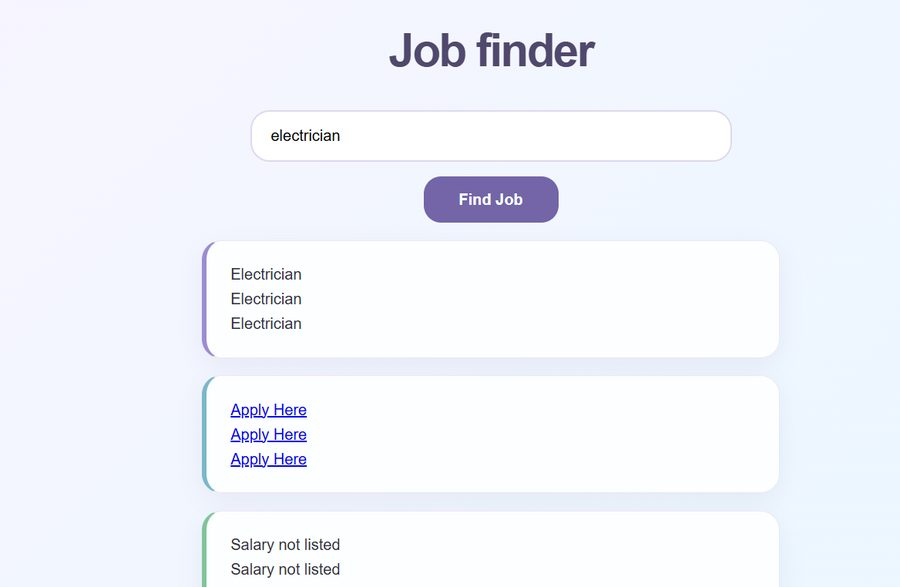

# Job Finder

Search trade jobs (construction, HVAC, plumbing, that world) and get the top results with apply links and salary info.

The API is moody about its fields. Salary shows up on some listings and not others, so the whole display leans on optional chaining to keep one missing field from blowing up the page.

Vanilla JavaScript with fetch. My code is on the `answer` branch.
